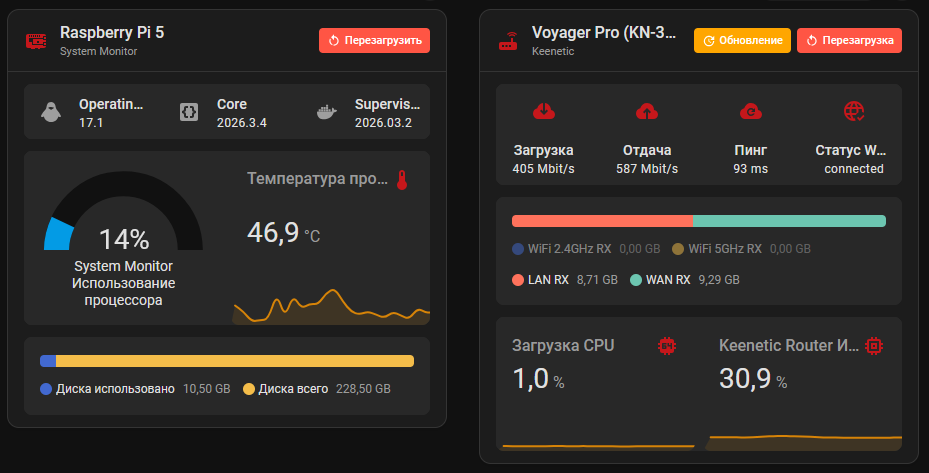

# Universal Device Card
[](https://github.com/custom-components/hacs) 


A universal Home Assistant Lovelace card for displaying and controlling any device. Supports nested cards, update badges, action buttons.



## 🌟 Features

🎯 **Universal Compatibility** - Works with any device in Home Assistant

📦 **Nested Cards** - Place any Lovelace cards inside for extended functionality

🔄 **Update Badge** - Shows when updates are available for your device

⚡ **Action Button** - Configurable button for rebooting or executing scripts

📱 **Automatic Device Info** - Automatically displays device model and manufacturer

🌐 **Localization** - English, Русский (automatically uses your HA language)

🔧 **Smart Card Styling** - Automatically styles nested cards to match the card design

## 📦 Installation

### Via HACS (Recommended)
1. HACS > Integrations > ⋮ > Custom repositories
2. URL: `https://github.com/RayzorST/universal-device-card`
3. Category: Plugin
4. Search for "Universal Device Card" and install

### Manual Installation
1. Download `universal-device-card.js` from the latest release
2. Place the file in `/config/www/community/universal-device-card/`
3. Add the resource to your Lovelace dashboard:
   - Go to Settings → Dashboards → Resources
   - Click "+ Add Resource"
   - URL: `/hacsfiles/universal-device-card/universal-device-card.js`
   - Type: JavaScript Module

## Configuration

### Configuration example

~~~yaml
type: custom:universal-device-card
name: Raspberry Pi 5
icon: mdi:raspberry-pi
device_id: 3f1d626ff9098f03ce8c6b6d92689b19
update_section:
  enabled: false
  entity: update.update_test
  label: ""
  tap_action:
    action: more-info
action_button:
  enabled: true
  entity: button.router_reboot
  confirmation: true
  icon: mdi:restart
  label: Перезагрузить
  tap_action:
    action: call-service
cards:
  - type: horizontal-stack
    cards:
      - type: tile
        entity: update.home_assistant_operating_system_update
        name:
          type: device
        state_content: installed_version
        vertical: false
        features_position: bottom
      - type: tile
        entity: update.home_assistant_core_update
        name:
          type: device
        state_content: installed_version
        vertical: false
        features_position: bottom
      - type: tile
        entity: update.home_assistant_supervisor_update
        name:
          type: device
        state_content: installed_version
        vertical: false
        features_position: bottom
~~~

### Configuration Options

| Option | Type | Default | Description |
|--------|------|---------|-------------|
| `type` | string | **Required** | `custom:universal-device-card` |
| `name` | string | Device model/name | Custom title for the card |
| `icon` | string | `mdi:devices` | Icon to display next to the title |
| `device_id` | string | `""` | Device ID from Home Assistant (auto-detects model/manufacturer) |
| `update_section` | object | See below | Configuration for update badge |
| `action_button` | object | See below | Configuration for action button |
| `cards` | array | `[]` | Array of Lovelace cards to display in the container |

### Update Section Options

| Option | Type | Default | Description |
|--------|------|---------|-------------|
| `enabled` | boolean | `true` | Show/hide the update badge |
| `entity` | string | `""` | Entity ID that indicates update availability (update, binary_sensor) |
| `label` | string | `"Update"` | Custom label for the badge |
| `tap_action` | object | `{ action: "more-info" }` | Action when clicking the badge |

### Action Button Options

| Option | Type | Default | Description |
|--------|------|---------|-------------|
| `enabled` | boolean | `false` | Show/hide the action button |
| `entity` | string | `""` | Entity to call (button, script, or service) |
| `confirmation` | boolean | `true` | Ask for confirmation before executing |
| `label` | string | `"Reboot"` | Button label text |
| `icon` | string | `mdi:restart` | Button icon |
| `tap_action` | object | `{ action: "call-service" }` | Action when clicking the button |
| `service_data` | object | `{}` | Service data for service calls |

### Tap Actions

All tap actions support the following types:

| Action | Description |
|--------|-------------|
| `more-info` | Opens the more-info dialog for the entity |
| `navigate` | Navigate to a different dashboard path |
| `url` | Open a URL in a new tab |
| `call-service` | Call a Home Assistant service |
| `toggle` | Toggle the entity (for toggleable entities) |
| `none` | Disable the action |

Example with custom action:
~~~yaml
tap_action:
  action: call-service
  service: button.press
  service_data:
    entity_id: button.custom_action
~~~

## 🔧 Development

### Prerequisites
- Node.js 18+
- npm or yarn

### Setup
```bash
git clone https://github.com/RayzorST/universal-device-card.git
cd universal-device-card
npm install
npm run build
